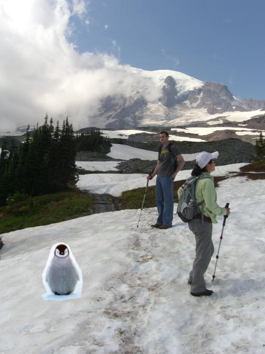
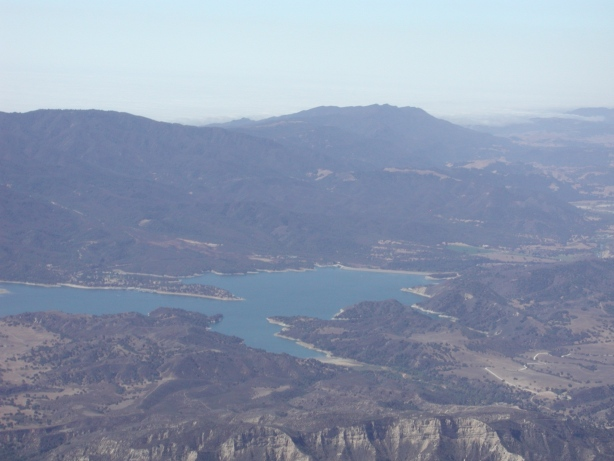

# Gradient Domain Fusion

Implementation of poisson blending technique described by Perez et al. in the paper Poisson Image Editing

## Image 1

## Image 2

## Naive Blend

## Poisson Blend

## Mixed gradients Blend

## Image 1

## Image 2

## Naive Blend

## Poisson Blend

## Mixed gradients Blend

## Image 1

## Image 2

## Naive Blend

## Poisson Blend

## Mixed gradients Blend

